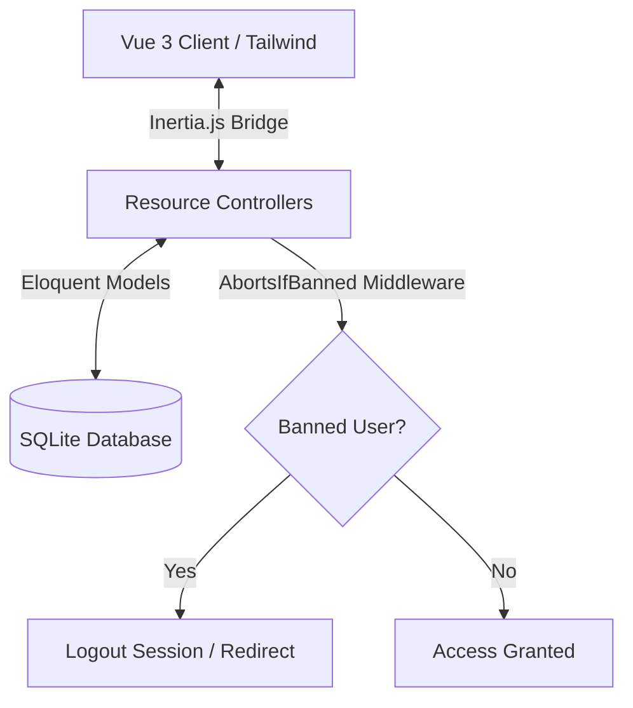

<div align="center">
  <br />
  
  
  # ⚡ FinFlow
  ### **Premium Financial Ledger & SaaS Billing Boilerplate**
  
  [](https://laravel.com)
  [](https://vuejs.org)
  [](https://tailwindcss.com)
  [](https://pestphp.com)
  
  <p align="center">
    A premium, high-contrast personal finance assistant, budget planner, and SaaS license manager.
    <br />
    Engineered with a streamlined monolithic stack for fast iteration, high security, and elegant usability.
  </p>
</div>

---

## 💎 Core Highlights

### 📊 Financial Ledger & Smart Budgeting
- **Real-Time Health**: Instantly tracks cumulative savings, monthly cash flow, and spending ratios.
- **Dynamic Category Limits**: Sets category-wise spending targets with warning progress bars that automatically change color (Green $\rightarrow$ Yellow warning $\rightarrow$ Red alert) as thresholds are reached.
- **Seeded Accounts**: Automatically provisions a default **"Cash"** account (with initial balance `$0.00`) and **10 pre-defined financial categories** for every new sign-up.

### 🔑 SaaS Licenses & Revenue Tracking
- **Automated Renewals**: Set billing cycles (monthly/yearly), next renewal dates, and status. Logging a payment automatically registers income and advances the renewal date.
- **Revenue Dashboard**: Displays Monthly Recurring Revenue (MRR) and Annual Recurring Revenue (ARR) calculations in real time.

### 🛡️ Superadmin Command Center
- **Granular Permissions Control**: Superadmins can enable or disable modules (Ledger, Budgets, SaaS, Loans, Recurring) for any user with real-time checkbox binds.
- **Permission-Driven Sidebar**: Navigation links in the left-sidebar automatically show/hide on the client-side based on user access.
- **Security Banning**: Toggle account bans instantly. Banned sessions are terminated on their next request via global middleware.
- **Self-Action Guardrails**: Logic blocks prevents superadmins from banning or deleting their own accounts.

### 🔔 FCM Push Notifications
- **Browser Subscriptions**: Push notification permission modal with background token registration.

---

## 🛠️ Stack Architecture



- **Backend**: Laravel 11 (PHP 8.2+) with Resource Controllers & strict Form Request validations.
- **Frontend**: Vue 3 (`<script setup>` Composition API), Inertia.js (SPA bridge), Vite compiler, and Tailwind CSS.
- **Database**: SQLite (Highly portable local database storage).
- **Testing**: Pest PHP (Modern testing framework).

---

## 🚀 Setup & Local Execution

### Prerequisites
- **PHP** (8.2 or higher)
- **Composer**
- **Node.js** & **npm**

### 1. Install Code Packages
```bash
# Install PHP dependencies
composer install

# Install JS dependencies
npm install
```

### 2. Environment Configurations
Clone the local environment template:
```bash
cp .env.example .env
```
*(Optional)* Add your Firebase credentials in `.env` to test Push Notifications:
```env
FIREBASE_API_KEY=your_api_key
FIREBASE_AUTH_DOMAIN=your_auth_domain
FIREBASE_PROJECT_ID=your_project_id
...
```

### 3. Migrate Schema
```bash
# Create SQLite DB file
touch database/database.sqlite

# Run database migrations
php artisan migrate
```

### 4. Boot Dev Servers
```bash
# Boot asset compiler (Terminal 1)
npm run dev

# Boot local server (Terminal 2)
php artisan serve
```
Open [http://127.0.0.1:8000](http://127.0.0.1:8000) in your web browser.

---

## 🧪 Comprehensive Quality Assurance

We maintain **86 feature test cases** validating authentication limits, category controls, SaaS logs, and superadmin middleware gates.

```bash
php artisan test
```

### Test Metrics
```text
Tests:  86 passed (315 assertions)
Time:   1.66s
```

---

## 📂 Codebase Navigation

*   **Database Schema**: [database/migrations/](file:///Users/morshedhabib/Sites/budget_management/database/migrations/)
*   **Eloquent Models**: [app/Models/](file:///Users/morshedhabib/Sites/budget_management/app/Models/) (User, Account, Category, Budget, Transaction, Client, License, PremiumServiceOrder)
*   **Controllers**: [app/Http/Controllers/](file:///Users/morshedhabib/Sites/budget_management/app/Http/Controllers/)
*   **Middlewares**: [app/Http/Middleware/](file:///Users/morshedhabib/Sites/budget_management/app/Http/Middleware/) (HandleInertiaRequests, AbortsIfBanned, CheckModulePermission, EnsureUserIsSuperadmin)
*   **Vue Components & Pages**: [resources/js/](file:///Users/morshedhabib/Sites/budget_management/resources/js/)
*   **Route Setup**: [routes/web.php](file:///Users/morshedhabib/Sites/budget_management/routes/web.php)
*   **Test Suite**: [tests/Feature/](file:///Users/morshedhabib/Sites/budget_management/tests/Feature/)

---

## 📄 License & Credits

Distributed under the MIT license. Developed with pride by **PRANTIK-SOFT** (Mobile: +8801735254295, Email: mhsohel017@gmail.com).
